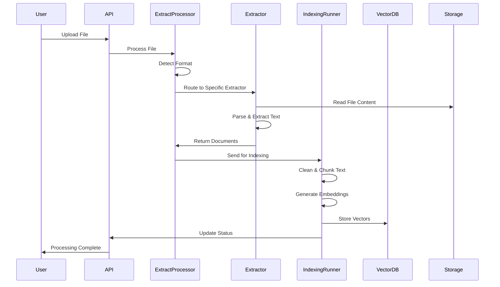

# STUDY_001: Dify File Format Support Analysis

## Executive Summary

Dify supports a wide range of file formats through a sophisticated multi-layered architecture that combines:
1. **Multiple extraction libraries** for different file types
2. **Dual ETL systems** (built-in and Unstructured.io)
3. **Vector database integration** for embedding and indexing
4. **Modular processor architecture** for extensibility

## Supported File Formats

Based on `api/constants/__init__.py`, Dify supports:

### Document Formats
- **Text**: txt, markdown, md, mdx, html, htm, properties
- **PDF**: pdf
- **Microsoft Office**: docx, doc, xlsx, xls, pptx, ppt
- **Other**: csv, vtt, eml, msg, xml, epub

### Media Formats
- **Images**: jpg, jpeg, png, webp, gif, svg
- **Video**: mp4, mov, mpeg, mpga
- **Audio**: mp3, m4a, wav, webm, amr

## Architecture Overview

### 1. File Processing Pipeline

```
File Upload → Format Detection → Extraction → Transformation → Chunking → Embedding → Vector Storage
```

### 2. Core Components

#### A. Extract Processor (`api/core/rag/extractor/extract_processor.py`)
- **Central orchestrator** for file processing
- **Dual ETL support**: Built-in extractors vs Unstructured.io API
- **Format routing**: Determines appropriate extractor based on file extension

#### B. Format-Specific Extractors

**Built-in Extractors:**
- `pdf_extractor.py` - Uses `pypdfium2` library
- `word_extractor.py` - Uses `python-docx` library  
- `excel_extractor.py` - Uses `pandas` + `openpyxl`
- `text_extractor.py` - Plain text processing
- `markdown_extractor.py` - Markdown parsing
- `html_extractor.py` - HTML content extraction
- `csv_extractor.py` - CSV data processing

**Unstructured.io Extractors:**
- `unstructured_pdf_extractor.py`
- `unstructured_doc_extractor.py`
- `unstructured_pptx_extractor.py`
- `unstructured_eml_extractor.py`
- `unstructured_epub_extractor.py`
- And more...

## Detailed Analysis

### 1. PDF Processing Pipeline

**Libraries Used:**
- `pypdfium2==4.30.0` (Primary PDF library)
- Unstructured.io API (Alternative)

**Code Location:** `api/core/rag/extractor/pdf_extractor.py`

**Processing Flow:**
```python
def parse(self, blob: Blob) -> Iterator[Document]:
    import pypdfium2
    with blob.as_bytes_io() as file_path:
        pdf_reader = pypdfium2.PdfDocument(file_path, autoclose=True)
        for page_number, page in enumerate(pdf_reader):
            text_page = page.get_textpage()
            content = text_page.get_text_range()
            # Create Document with metadata
            yield Document(page_content=content, metadata={"source": blob.source, "page": page_number})
```

**Features:**
- Page-by-page extraction
- Metadata preservation (source, page numbers)
- Caching support for performance
- Memory-efficient streaming processing

### 2. Microsoft Word Processing Pipeline

**Libraries Used:**
- `python-docx~=1.1.0`
- Image processing with storage integration

**Code Location:** `api/core/rag/extractor/word_extractor.py`

**Advanced Features:**
- **Image extraction and storage**: Extracts embedded images, stores them in cloud storage
- **Table to Markdown conversion**: Converts Word tables to Markdown format
- **Hyperlink preservation**: Maintains clickable links
- **Complex document structure handling**: Paragraphs, tables, images in proper order

**Processing Flow:**
```python
def parse_docx(self, docx_path, image_folder):
    doc = DocxDocument(docx_path)
    image_map = self._extract_images_from_docx(doc)  # Extract and store images
    
    # Process document elements in order
    for element in doc.element.body:
        if element.tag.endswith("p"):  # paragraph
            parsed_paragraph = parse_paragraph(para)
        elif element.tag.endswith("tbl"):  # table
            content.append(self._table_to_markdown(table, image_map))
```

### 3. Excel Processing Pipeline

**Libraries Used:**
- `pandas[excel,output-formatting,performance]~=2.2.2`
- `openpyxl~=3.1.5`

**Code Location:** `api/core/rag/extractor/excel_extractor.py`

**Features:**
- **Multi-sheet support**: Processes all sheets in workbook
- **Hyperlink preservation**: Maintains Excel hyperlinks in output
- **Data type handling**: Proper handling of different cell types
- **Row-by-row processing**: Each row becomes a separate document

### 4. Dual ETL System Architecture

**Configuration:** Based on `ETL_TYPE` environment variable

#### Built-in ETL (Default)
```python
if file_extension == ".pdf":
    extractor = PdfExtractor(file_path)
elif file_extension == ".docx":
    extractor = WordExtractor(file_path, upload_file.tenant_id, upload_file.created_by)
```

#### Unstructured.io ETL
```python
if etl_type == "Unstructured":
    if file_extension == ".pdf":
        extractor = PdfExtractor(file_path)  # Still uses built-in for PDF
    elif file_extension == ".doc":
        extractor = UnstructuredWordExtractor(file_path, unstructured_api_url, unstructured_api_key)
```

**Benefits:**
- **Flexibility**: Choose between local processing vs cloud API
- **Format coverage**: Unstructured.io supports more formats (ppt, eml, msg, epub)
- **Performance options**: Local processing for speed, cloud for advanced features

### 5. Vector Database Integration Pipeline

**Flow:** Document → Chunking → Embedding → Vector Storage

**Code Location:** `api/core/indexing_runner.py`

**Process:**
1. **Text Extraction**: Files converted to text using extractors
2. **Document Cleaning**: Remove unwanted characters, apply processing rules
3. **Text Chunking**: Split into manageable segments using various splitters
4. **Embedding Generation**: Convert text chunks to vector embeddings
5. **Vector Storage**: Store in chosen vector database (Weaviate, Qdrant, etc.)

**Chunking Strategies:**
```python
def _get_splitter(processing_rule_mode, max_tokens, chunk_overlap, separator, embedding_model_instance):
    if processing_rule_mode in ["custom", "hierarchical"]:
        # User-defined segmentation
        character_splitter = FixedRecursiveCharacterTextSplitter.from_encoder(
            chunk_size=max_tokens,
            chunk_overlap=chunk_overlap,
            fixed_separator=separator,
            separators=["\n\n", "。", ". ", " ", ""],
            embedding_model_instance=embedding_model_instance,
        )
    else:
        # Automatic segmentation
        character_splitter = EnhanceRecursiveCharacterTextSplitter.from_encoder(...)
```

### 6. Document Processing Workflow Sequence Diagram



### 7. Key Dependencies and Libraries

**Core Processing Libraries:**
- `pypdfium2==4.30.0` - PDF processing
- `python-docx~=1.1.0` - Word document processing
- `openpyxl~=3.1.5` - Excel file processing
- `pandas[excel,output-formatting,performance]~=2.2.2` - Data manipulation
- `unstructured[docx,epub,md,ppt,pptx]~=0.16.1` - Advanced document processing
- `beautifulsoup4==4.12.2` - HTML parsing
- `markdown~=3.5.1` - Markdown processing

**Vector Database Clients:**
- `weaviate-client~=3.24.0`
- `qdrant-client==1.9.0`
- `chromadb==0.5.20`
- `pymilvus~=2.5.0`
- And 15+ other vector database clients

## Advanced Features

### 1. Image Handling in Documents
- **Extraction**: Images embedded in Word docs are extracted and stored separately
- **Storage Integration**: Uses configurable storage backends (S3, Azure, etc.)
- **Markdown Conversion**: Images converted to Markdown image syntax with URLs
- **Database Tracking**: Image files tracked in database with metadata

### 2. Table Processing
- **Word Tables**: Converted to Markdown table format
- **Excel Sheets**: Each row becomes a searchable document
- **Hyperlink Preservation**: Links maintained in final output
- **Multi-sheet Support**: All Excel sheets processed

### 3. Metadata Preservation
- **Source Tracking**: Original file path/URL maintained
- **Page Numbers**: PDF page numbers preserved
- **Document Structure**: Hierarchical information maintained
- **Processing History**: Timestamps and processing details tracked

### 4. Performance Optimizations
- **Caching**: Processed text cached to avoid reprocessing
- **Streaming**: Large files processed in chunks
- **Parallel Processing**: Multi-threaded indexing for performance
- **Memory Management**: Efficient memory usage for large documents

## Extensibility Mechanisms

### 1. Extractor Factory Pattern
```python
class ExtractProcessor:
    @classmethod
    def extract(cls, extract_setting: ExtractSetting):
        # Route to appropriate extractor based on file type
        if file_extension == ".pdf":
            extractor = PdfExtractor(file_path)
        elif file_extension == ".docx":
            extractor = WordExtractor(file_path)
        # Easy to add new extractors
```

### 2. Plugin Architecture
- **Base Extractor Class**: All extractors inherit from `BaseExtractor`
- **Standardized Interface**: Consistent `extract()` method across all extractors
- **Configuration Driven**: ETL type selection via environment variables

### 3. Storage Abstraction
- **Multiple Backends**: S3, Azure Blob, Google Cloud, local filesystem
- **Unified Interface**: Single storage API regardless of backend
- **Configuration Based**: Storage type selected via environment variables

## Conclusion

Dify's file format support is achieved through:

1. **Multi-library Approach**: Different specialized libraries for each format type
2. **Dual ETL Systems**: Built-in extractors + Unstructured.io integration for maximum coverage
3. **Vector Database Layer**: Sophisticated chunking, embedding, and indexing pipeline
4. **Modular Architecture**: Easy to extend with new formats and processors
5. **Advanced Features**: Image extraction, table processing, metadata preservation
6. **Performance Focus**: Caching, streaming, parallel processing

This architecture provides comprehensive file format support while maintaining flexibility, performance, and extensibility for future enhancements.
